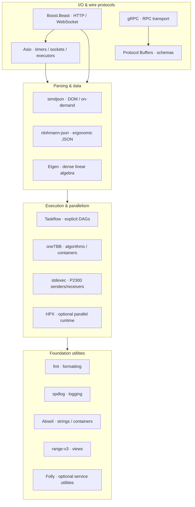
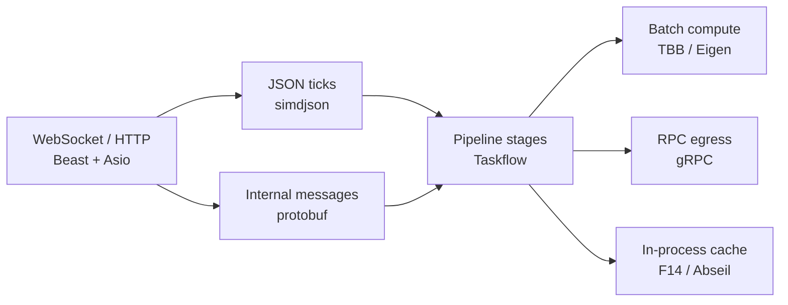

# C++26 Systems Stack

[](#language--toolchain)
[](#build)
[](#dependencies)
[](LICENSE)

**Integration laboratory for a modern C++26 systems ecosystem** — async I/O, HTTP/WebSocket, task graphs, data-parallel runtimes, sender/receiver composition, high-performance JSON, schema/RPC, optional service foundations (Folly, HPX), portable **low-latency primitives** under `include/ll/`, and **industry libraries** (hwloc, FlatBuffers, SBE, struct_pack, moodycamel, Boost.Lockfree, Folly PCQ, std::pmr, mimalloc, jemalloc, HdrHistogram, Google Benchmark; DPDK/Onload detect + stub RX).

This repository is **not** a toy “hello world” collection. It is a **buildable reference stack**: CMake-wired dependencies, executable integration binary, Catch2/GTest suites, microbenchmarks, architecture guides, and a six-layer low-latency **blueprint audit**.

| | |
|--|--|
| **Language** | ISO C++26 (`CMAKE_CXX_STANDARD 26`) |
| **Build** | CMake 3.28+ · Make wrapper · **CMakePresets** (CLion) |
| **Package sources** | Homebrew (base + industry) · FetchContent (`stdexec`, moodycamel) · optional HPX |
| **Low-latency core** | `ll::*` — SPSC, arena/pmr, HDR histogram, SBE-style wire, TSC, affinity |
| **Industry optional** | hwloc · FlatBuffers · SBE · struct_pack · mimalloc · jemalloc · Folly PCQ · Benchmark · DPDK/Onload detect |
| **IDE** | CLion: preset `clion-debug` + target `ide_index` — see [docs/clion.md](docs/clion.md) |
| **Monorepo** | Submodule of private [`Dmdv/cpp_agents_benchmark`](https://github.com/Dmdv/cpp_agents_benchmark) as `systems_stack/` |

---

## Primary focus (which layer of the stack?)

Audited against the industry low-latency checklist (hardware/OS → kernel bypass → memory → concurrency → compiler → telemetry):

> **Center of gravity: concurrency + memory + C++26 library mesh**, wired to **industry standards**  
> (`ll`/Boost/moodycamel queues, std::pmr arenas, hwloc, FlatBuffers/SBE-style, HDR + Google Benchmark)  
> Kernel bypass (DPDK/Onload) remains a documented envelope — not a NIC driver product.

| Rank | Layer | Status in this repo |
|------|--------|---------------------|
| **1** | §4 Concurrency + §3 Memory | **SHIPPED** — `ll` SPSC, Boost.Lockfree, moodycamel*, pmr/arena, cache lines |
| **2** | C++26 library mesh (I/O, parse, schedule, RPC) | **SHIPPED** — full integration binary + suites |
| **3** | §6 Telemetry | **SHIPPED** — TSC, portable HDR, **HdrHistogram_c**, Google Benchmark* |
| **4** | §1 / §2 portable wire | **SHIPPED** — **SBE codegen**, hwloc*, FlatBuffers*, numa/uring APIs |
| **5** | §2 Kernel bypass drivers | **Contract + lab** — stub RX shipped; DPDK/Onload not linked |

\*auto-enabled when the package is installed (`make install-industry`).

### Roadmap (recommended order) — implemented

| # | Investment | Status | Tutorial |
|---|------------|--------|----------|
| 1 | Real Logic **SBE codegen** for production schemas | **Done** | [sbe-codegen.md](docs/tutorials/sbe-codegen.md) |
| 2 | Linux **numa + io_uring** demos + CI | **Done** | [linux-numa-uring.md](docs/tutorials/linux-numa-uring.md) |
| 3 | **HdrHistogram_c** beside portable HDR | **Done** | [hdrhistogram-c.md](docs/tutorials/hdrhistogram-c.md) |
| 4 | **DPDK / Onload** dedicated NIC lab | **Done** (API + runbook; no vendor SDK) | [kernel-bypass-lab.md](docs/tutorials/kernel-bypass-lab.md) |

```bash
./scripts/generate_sbe.sh          # regenerate SBE C++ from XML (Java)
ctest --test-dir build -R roadmap  # SBE · numa · uring · hdr_c · bypass
./build/example_sbe_codegen
./build/example_numa_uring
./build/example_hdr_c
./build/example_kernel_bypass
```

Full checklist: [`docs/blueprint/AUDIT.md`](docs/blueprint/AUDIT.md) · industry map: [`docs/blueprint/07-industry-libraries.md`](docs/blueprint/07-industry-libraries.md) · tutorials: [`docs/tutorials/`](docs/tutorials/).
---

## Ecosystem map



### Suggested composition for a market-data / services path



---

## Repository layout

```text
.
├── CMakeLists.txt          # C++26 · Folly/HPX · ll + industry STACK_WITH_*
├── Makefile                # base / folly / hpx / full / examples / bench
├── include/ll/             # SPSC, pmr, HDR, SBE helpers, numa, uring, bypass, …
├── generated/sbe/          # Real Logic SBE C++ codecs (committed)
├── schemas/                # tick.fbs · sbe-market-data-schema.xml
├── examples/               # ll + industry + roadmap demos
├── benchmarks/             # Google Benchmark (bench_queues)
├── tests/                  # Catch2/GTest · ll · industry · roadmap
├── scripts/generate_sbe.sh # regenerate SBE headers (Java)
├── scripts/ci/linux_roadmap/  # minimal Linux CI (numa/uring)
├── .github/workflows/ci.yml
├── docs/libraries/         # per-component architecture notes
├── docs/blueprint/         # six-layer audit + industry map
└── docs/tutorials/         # industry + SBE + numa/uring + HDR_c + bypass lab
```
---

## Component catalog

### Library mesh

| Domain | Component | Guide | Validation |
|--------|-----------|-------|------------|
| Async I/O | **Asio** (standalone) | [asio.md](docs/libraries/asio.md) | `test_beast_asio` |
| HTTP / WS | **Boost.Beast** | [beast.md](docs/libraries/beast.md) | `ctest -R beast` |
| Task DAGs | **Taskflow** | [taskflow.md](docs/libraries/taskflow.md) | `test_taskflow` |
| Data parallel | **oneTBB** | [tbb.md](docs/libraries/tbb.md) | `ctest -R tbb` / `test_libs` |
| Senders / receivers | **stdexec** (P2300) | [stdexec.md](docs/libraries/stdexec.md) | `ctest -R stdexec` / `test_libs` |
| JSON (hot path) | **simdjson** | [simdjson.md](docs/libraries/simdjson.md) | `ctest -R simdjson` |
| Schema / RPC | **protobuf + gRPC** | [grpc-protobuf.md](docs/libraries/grpc-protobuf.md) | `ctest -R protobuf` |
| Service utilities | **Folly** (optional) | [folly.md](docs/libraries/folly.md) | `make folly` |
| Parallel runtime | **HPX** (optional) | [hpx.md](docs/libraries/hpx.md) | `make hpx` |
| Formatting / log | **fmt**, **spdlog** | catalog below | `test_libs` |
| Strings / maps | **Abseil** | catalog below | `test_libs` |
| Views | **range-v3** | catalog below | `test_libs` |
| Linear algebra | **Eigen** | catalog below | `test_libs` |
| Unit frameworks | **Catch2**, **GTest** | — | `ctest` |

Full library index: [`docs/libraries/README.md`](docs/libraries/README.md).

### Low-latency modules (`include/ll/`)

| Module | Header | Layer | Validation |
|--------|--------|-------|------------|
| Cache-line constants | `ll/cache_line.hpp` | §3 Memory | `ctest -R ll` |
| SPSC ring buffer | `ll/spsc_queue.hpp` | §4 Concurrency | `test_ll_modules` · `make examples` |
| Arena / object pool | `ll/arena.hpp` | §3 Memory | `[ll][arena]` · `example_arena` |
| **std::pmr** arenas | `ll/pmr_arena.hpp` | §3 Memory | `[industry][pmr]` · `example_pmr` |
| **HDR histogram** | `ll/hdr_histogram.hpp` | §6 Telemetry | `[industry][hdr]` · `example_hdr` |
| **SBE-style wire** | `ll/sbe_style.hpp` | §2 Serde | `[industry][sbe]` · `example_sbe_style` |
| **SBE codegen helpers** | `ll/sbe_codec.hpp` + `generated/sbe/` | §2 Serde | `[roadmap][sbe]` · `example_sbe_codegen` |
| **Linux NUMA** | `ll/linux_numa.hpp` | §1 | `[roadmap][numa]` · `example_numa_uring` |
| **Linux io_uring** | `ll/linux_uring.hpp` | §2 | `[roadmap][uring]` |
| **HdrHistogram_c** | `ll/hdr_c.hpp` | §6 | `[roadmap][hdr_c]` · `example_hdr_c` |
| **Kernel-bypass contract** | `ll/kernel_bypass.hpp` | §2 | `[roadmap][bypass]` · `example_kernel_bypass` |
| TSC / latency samples | `ll/tsc_clock.hpp` | §6 Telemetry | `[ll][tsc]` · `example_tsc` |
| Thread affinity / QoS | `ll/affinity.hpp` | §1 Hardware/OS | `[ll][affinity]` |
| Branch / CRTP helpers | `ll/branch.hpp` | §5 Compiler | `[ll][branch]` |
| Industry umbrella | `ll/industry.hpp` | all | feature macros `LL_HAS_*` |

### Industry libraries (auto-detect)

| Library | Layer | CMake / install | Validation |
|---------|-------|-----------------|------------|
| **Boost.Lockfree** | §4 | always (Boost required) | `[industry][boost_lockfree]` |
| **moodycamel** ReaderWriterQueue | §4 | FetchContent (`STACK_WITH_MOODYCAMEL`) | `[industry][moodycamel]` |
| **hwloc** | §1 | `brew install hwloc` | `[industry][hwloc]` |
| **FlatBuffers** | §2 | `brew install flatbuffers` | `[industry][flatbuffers]` |
| **mimalloc** | §3 off-path | `brew install mimalloc` | `[industry][mimalloc]` |
| **jemalloc** | §3 off-path | `brew install jemalloc` | `[industry][jemalloc]` |
| **struct_pack** | §2 serde | FetchContent yalantinglibs | `[industry][struct_pack]` · `example_struct_pack` |
| **folly::PCQ** | §4 | auto if Folly installed | `[industry][folly_pcq]` / `make folly` |
| **Google Benchmark** | §6 | `brew install google-benchmark` | `make bench` |
| **libnuma / liburing** | §1 / §2 | Linux packages | soft-detect + Linux CI smoke |
| **HdrHistogram_c** | §6 | FetchContent | default ON |
| **Real Logic SBE tool** | §2 | `./scripts/generate_sbe.sh` | committed generated headers |
| **DPDK / OpenOnload** | §2 | optional detect if installed | stub RX always; SDK when present |

```bash
make install-industry   # hwloc flatbuffers google-benchmark mimalloc jemalloc
brew install folly      # optional: folly::ProducerConsumerQueue tests
```

Blueprint: [`docs/blueprint/`](docs/blueprint/) · Tutorial: [`docs/tutorials/industry-stack.md`](docs/tutorials/industry-stack.md).
---

## Language & toolchain

| Requirement | Value |
|-------------|--------|
| ISO C++ | **26** (`CMAKE_CXX_STANDARD 26`, extensions off) |
| CMake | **≥ 3.28** |
| Compilers | Recent Clang (Apple/LLVM) or GCC with C++26 support |
| Architectures | **AArch64 (ARM)** and **x86-64 (Intel/AMD)** — native builds; cross via toolchain examples |
| Package manager (macOS) | Homebrew under `/opt/homebrew` (arm64) or `/usr/local` (x86_64) |

Design choices encoded in CMake:

- **Base profile** configures quickly without Folly/HPX  
- **Folly / HPX** are explicit opt-in (`LIB_SMOKE_WITH_FOLLY`, `LIB_SMOKE_WITH_HPX`)  
- **stdexec** is pulled via **FetchContent** (not packaged on Homebrew)  
- Folly is deliberately **not** on the shared interface target to avoid include-flag collisions with Beast/Asio on Apple Clang

---

## Dependencies

### Base stack (Homebrew)

```bash
brew install cmake fmt spdlog tbb asio boost taskflow \
  nlohmann-json simdjson eigen protobuf grpc \
  range-v3 abseil catch2 googletest
```

### Optional — service / parallel runtimes

```bash
brew install folly
make install-hpx          # local prefix, default ~/cpp-deps/hpx
```

### Optional — industry low-latency

```bash
make install-industry     # hwloc flatbuffers google-benchmark mimalloc
# Linux: libnuma-dev liburing-dev (soft-detected)
```

### Status check

```bash
make deps-check
```
---

## Build

```bash
# Base stack: configure + build + ctest
make

# Optional profiles (isolated build directories)
make folly                # + Folly
make hpx                  # + HPX
make full                 # Folly + HPX

# Integration binary
make run

# Low-latency + industry examples
make examples

# Queue microbenchmarks (requires google-benchmark)
make bench

# IDE / clangd (classic build tree)
make compile-commands

# CLion — full IntelliSense (types, completion, go-to-def)
make clion          # cmake --preset clion-debug + compile_commands.json
make clion-index    # build tools/ide_index.cpp (indexes all public types)

# Ninja generator (optional; isolated build_ninja/ tree)
make ninja          # cmake -G Ninja + build + ctest
make ninja-help     # list targets
```

**CLion:** open the repo root → enable CMake preset **`clion-debug`** → build target **`ide_index`**.  
Details: [`docs/clion.md`](docs/clion.md) · presets: [`CMakePresets.json`](CMakePresets.json).

**Ninja:** Ninja is a *build system* (not a compiler). Tutorial: [`docs/tutorials/ninja-build.md`](docs/tutorials/ninja-build.md).

**ARM & Intel tooling / cross-compilation:**  
[`docs/tutorials/modern-cpp-tooling-arm-intel.md`](docs/tutorials/modern-cpp-tooling-arm-intel.md) · example toolchains under [`cmake/toolchains/`](cmake/toolchains/).
| Make target | Effect |
|-------------|--------|
| `make` / `all` | Base configure, build, test |
| `make run` | Execute integration binary |
| `make examples` | Build and run `ll` + industry demos |
| `make bench` | Google Benchmark (`bench_queues`) |
| `make test` | `ctest` in current `BUILD_DIR` |
| `make folly` / `hpx` / `full` | Optional stacks |
| `make install-industry` | Homebrew industry packages |
| `make ninja` | Configure/build/test with **`-G Ninja`** → `build_ninja/` |
| `make distclean` | Remove all `build*` trees |
| `make deps-check` | Inventory Homebrew + industry + HPX |
| `make docs` | List library + blueprint + tutorials |

CMake options:

```bash
cmake -S . -B build \
  -DCMAKE_BUILD_TYPE=Release \
  -DLIB_SMOKE_WITH_FOLLY=ON \
  -DLIB_SMOKE_WITH_HPX=ON \
  -DLIB_SMOKE_HPX_ROOT=$HOME/cpp-deps/hpx
```

---

## Samples & tests

### Integration binary (`src/main.cpp`)

One process walks the stack end-to-end and prints `[PASS]` / `[FAIL]` per check: Asio, Beast version, fmt/spdlog, Abseil, TBB reduce, Taskflow, ranges, JSON (nlohmann + simdjson), Eigen, protobuf/gRPC versions, stdexec pool, and optionally Folly/HPX.

```bash
./build/lib_smoke
```

### Automated suites

| Target | Framework | Focus |
|--------|-----------|--------|
| `test_beast_asio` | Catch2 | Asio posts/timers · Beast HTTP types |
| `test_taskflow` | Catch2 | Task graph execution |
| `test_libs` | Catch2 | fmt, TBB, simdjson, nlohmann, Eigen, Abseil, ranges, protobuf, stdexec |
| `test_ll_modules` | Catch2 | SPSC stress, arena/pool, TSC, affinity, CRTP |
| `test_industry_stack` | Catch2 | pmr, SBE, struct_pack, queues, allocators, bypass caps, … |
| `test_roadmap_stack` | Catch2 | SBE codegen, numa, uring, HdrHistogram_c, bypass stub |
| `test_gtest_smoke` | GTest | Framework install sanity |
| `test_folly` | Catch2 | Folly (optional profile) |
| `test_hpx` | Catch2 | HPX (optional profile) |

```bash
ctest --test-dir build --output-on-failure
ctest --test-dir build -R 'll|industry|simdjson'
```

### Blueprint & industry examples

| Binary | Topic |
|--------|--------|
| `example_spsc` | Producer/consumer handoff via lock-free ring |
| `example_arena` | Bump-pointer temporary state (no malloc on path) |
| `example_pmr` | `std::pmr` monotonic arena windows |
| `example_hdr` | p50 / p99 / p99.9 / max latency printout |
| `example_sbe_style` | Packed 16-byte wire tick (teaching POD) |
| `example_sbe_codegen` | Real Logic SBE generated Tick encode/decode |
| `example_numa_uring` | NUMA + io_uring backend status |
| `example_hdr_c` | Portable HDR vs HdrHistogram_c |
| `example_kernel_bypass` | Stub poll-mode RX + SBE payload |
| `example_industry_queues` | `ll` vs Boost.Lockfree vs moodycamel |
| `example_memory_order` | acquire/release flag handoff |
| `example_tsc` | Cycle/ns timestamps around a tight kernel |
| `bench_queues` | Google Benchmark comparison |

```bash
make examples
make bench
```

---

## Design principles

1. **C++26 first** — standard-library direction (senders/receivers, jthread, `std::pmr`) coexists with industry libs.  
2. **Composable layers** — I/O, parse, schedule, compute, RPC are separate concerns.  
3. **Don’t reinvent every wheel** — prefer verified queues (Boost.Lockfree, moodycamel), topology (hwloc), and serde (FlatBuffers/SBE) where they fit.  
4. **Low-latency honesty** — ship portable primitives; auto-enable industry deps; document OS noise and kernel bypass without claiming DPDK ownership.  
5. **Keep the hot path small** — i-cache discipline and single-thread/actor paths are first-class design reviews.  
6. **Measurable integration** — Catch2 suites + Google Benchmark; prefer **p99 / p99.9 / max** over mean.  
7. **Optional heavyweights** — Folly/HPX/mimalloc/benchmark do not break the default path when missing.  
8. **Production-minded wiring** — real `find_package`, protobuf + flatc generation, Folly/Beast coexistence notes in CMake.

---

## Monorepo integration

Private suite: [`Dmdv/cpp_agents_benchmark`](https://github.com/Dmdv/cpp_agents_benchmark)

```text
cpp_agents_benchmark/          (private)
├── systems_stack/  ──submodule──►  Dmdv/cpp26-systems-stack  (this repo)
├── asm_test/       ──submodule──►  Dmdv/hft-asm-l2-conflator
└── … agent benchmarks …
```

```bash
git clone --recurse-submodules https://github.com/Dmdv/cpp_agents_benchmark.git
```

Sources for this stack live **only** here; the private monorepo holds a gitlink, not a second copy.

---

## Related repositories

| Repo | Role |
|------|------|
| [cpp26-systems-stack](https://github.com/Dmdv/cpp26-systems-stack) | This project — C++26 systems ecosystem |
| [hft-asm-l2-conflator](https://github.com/Dmdv/hft-asm-l2-conflator) | AArch64 assembler HFT L2 conflator |
| [cpp_agents_benchmark](https://github.com/Dmdv/cpp_agents_benchmark) | Private multi-agent benchmark monorepo |

---

## License

MIT — see [LICENSE](LICENSE).
