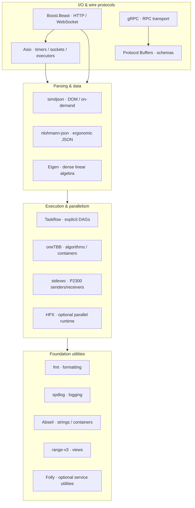
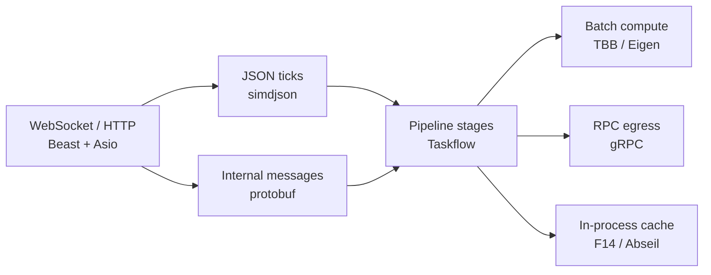

# C++26 Systems Stack

[](#language--toolchain)
[](#build)
[](#dependencies)
[](LICENSE)

**Integration laboratory for a modern C++26 systems ecosystem** — async I/O, HTTP/WebSocket, task graphs, data-parallel runtimes, sender/receiver composition, high-performance JSON, schema/RPC, optional service foundations (Folly, HPX), plus portable **low-latency primitives** under `include/ll/`.

This repository is **not** a toy “hello world” collection. It is a **buildable reference stack**: CMake-wired dependencies, executable integration binary, Catch2/GTest suites, architecture-oriented library guides, and a six-layer low-latency **blueprint audit**.

| | |
|--|--|
| **Language** | ISO C++26 (`CMAKE_CXX_STANDARD 26`) |
| **Build** | CMake 3.28+ · Make wrapper |
| **Package sources** | Homebrew (base) · FetchContent (`stdexec`) · optional local HPX |
| **Low-latency core** | Header-only `ll::*` (SPSC, arena/pool, TSC, affinity, branch/CRTP) |
| **Monorepo** | Submodule of private [`Dmdv/cpp_agents_benchmark`](https://github.com/Dmdv/cpp_agents_benchmark) as `systems_stack/` |

---

## Primary focus (which layer of the stack?)

Audited against the industry low-latency checklist (hardware/OS → kernel bypass → memory → concurrency → compiler → telemetry):

> **Center of gravity: concurrency + memory architecture + the C++26 library mesh**  
> (SPSC / atomics, arenas & cache-line layout, Asio/Beast/Taskflow/TBB/stdexec/simdjson/gRPC)  
> with hardware/OS and kernel-bypass documented as the surrounding envelope — not productized NIC drivers.

| Rank | Layer | Status in this repo |
|------|--------|---------------------|
| **1** | §4 Concurrency + §3 Memory | **SHIPPED** — `ll/spsc_queue`, `ll/arena`, `ll/cache_line` + tests/examples |
| **2** | C++26 library mesh (I/O, parse, schedule, RPC) | **SHIPPED** — full integration binary + suites |
| **3** | §6 Telemetry primitives | **SHIPPED** — `ll/tsc_clock`, fixed `LatencyBuffer`; full HDR **GAP** |
| **4** | §1 Hardware/OS + §5 Compiler | **DOC** / partial API — affinity, flags, i-cache discipline |
| **5** | §2 Kernel bypass (DPDK / Onload / SBE) | **GAP** (documented boundary) |

Full checklist: [`docs/blueprint/AUDIT.md`](docs/blueprint/AUDIT.md) · layer guides: [`docs/blueprint/`](docs/blueprint/).

---

## Ecosystem map



### Suggested composition for a market-data / services path



---

## Repository layout

```text
.
├── CMakeLists.txt          # C++26 project · optional Folly/HPX · ll_headers
├── Makefile                # developer workflows (base / folly / hpx / full / examples)
├── include/ll/             # portable low-latency headers (SPSC, arena, TSC, …)
├── examples/               # blueprint demos (spsc, arena, memory_order, tsc)
├── proto/smoke.proto       # sample protobuf message
├── src/main.cpp            # integration binary: one-shot stack exercise
├── src/folly_compat.hpp    # Folly + libc++ coexistence helpers
├── tests/                  # Catch2 + GTest + test_ll_modules
├── scripts/install_hpx.sh  # local HPX bootstrap (not on Homebrew)
├── docs/libraries/         # per-component architecture notes
└── docs/blueprint/         # six-layer low-latency audit + guides
```

---

## Component catalog

### Library mesh

| Domain | Component | Guide | Validation |
|--------|-----------|-------|------------|
| Async I/O | **Asio** (standalone) | [asio.md](docs/libraries/asio.md) | `test_beast_asio` |
| HTTP / WS | **Boost.Beast** | [beast.md](docs/libraries/beast.md) | `ctest -R beast` |
| Task DAGs | **Taskflow** | [taskflow.md](docs/libraries/taskflow.md) | `test_taskflow` |
| Data parallel | **oneTBB** | [tbb.md](docs/libraries/tbb.md) | `ctest -R tbb` / `test_libs` |
| Senders / receivers | **stdexec** (P2300) | [stdexec.md](docs/libraries/stdexec.md) | `ctest -R stdexec` / `test_libs` |
| JSON (hot path) | **simdjson** | [simdjson.md](docs/libraries/simdjson.md) | `ctest -R simdjson` |
| Schema / RPC | **protobuf + gRPC** | [grpc-protobuf.md](docs/libraries/grpc-protobuf.md) | `ctest -R protobuf` |
| Service utilities | **Folly** (optional) | [folly.md](docs/libraries/folly.md) | `make folly` |
| Parallel runtime | **HPX** (optional) | [hpx.md](docs/libraries/hpx.md) | `make hpx` |
| Formatting / log | **fmt**, **spdlog** | catalog below | `test_libs` |
| Strings / maps | **Abseil** | catalog below | `test_libs` |
| Views | **range-v3** | catalog below | `test_libs` |
| Linear algebra | **Eigen** | catalog below | `test_libs` |
| Unit frameworks | **Catch2**, **GTest** | — | `ctest` |

Full library index: [`docs/libraries/README.md`](docs/libraries/README.md).

### Low-latency modules (`include/ll/`)

| Module | Header | Layer | Validation |
|--------|--------|-------|------------|
| Cache-line constants | `ll/cache_line.hpp` | §3 Memory | `ctest -R ll` |
| SPSC ring buffer | `ll/spsc_queue.hpp` | §4 Concurrency | `test_ll_modules` · `make examples` |
| Arena / object pool | `ll/arena.hpp` | §3 Memory | `[ll][arena]` · `example_arena` |
| TSC / latency samples | `ll/tsc_clock.hpp` | §6 Telemetry | `[ll][tsc]` · `example_tsc` |
| Thread affinity / QoS | `ll/affinity.hpp` | §1 Hardware/OS | `[ll][affinity]` |
| Branch / CRTP helpers | `ll/branch.hpp` | §5 Compiler | `[ll][branch]` |

Blueprint narrative: [`docs/blueprint/LOW_LATENCY_STACK.md`](docs/blueprint/LOW_LATENCY_STACK.md).

---

## Language & toolchain

| Requirement | Value |
|-------------|--------|
| ISO C++ | **26** (`CMAKE_CXX_STANDARD 26`, extensions off) |
| CMake | **≥ 3.28** |
| Compilers | Recent Clang (Apple/LLVM) or GCC with C++26 support |
| Package manager (macOS) | Homebrew under `/opt/homebrew` or `/usr/local` |

Design choices encoded in CMake:

- **Base profile** configures quickly without Folly/HPX  
- **Folly / HPX** are explicit opt-in (`LIB_SMOKE_WITH_FOLLY`, `LIB_SMOKE_WITH_HPX`)  
- **stdexec** is pulled via **FetchContent** (not packaged on Homebrew)  
- Folly is deliberately **not** on the shared interface target to avoid include-flag collisions with Beast/Asio on Apple Clang

---

## Dependencies

### Base stack (Homebrew)

```bash
brew install cmake fmt spdlog tbb asio boost taskflow \
  nlohmann-json simdjson eigen protobuf grpc \
  range-v3 abseil catch2 googletest
```

### Optional

```bash
brew install folly
make install-hpx          # local prefix, default ~/cpp-deps/hpx
```

### Status check

```bash
make deps-check
```

---

## Build

```bash
# Base stack: configure + build + ctest
make

# Optional profiles (isolated build directories)
make folly                # + Folly
make hpx                  # + HPX
make full                 # Folly + HPX

# Integration binary
make run

# Low-latency blueprint examples (SPSC, arena, memory_order, TSC)
make examples

# IDE / clangd
make compile-commands
```

| Make target | Effect |
|-------------|--------|
| `make` / `all` | Base configure, build, test |
| `make run` | Execute integration binary |
| `make examples` | Build and run `ll` demos |
| `make test` | `ctest` in current `BUILD_DIR` |
| `make folly` / `hpx` / `full` | Optional stacks |
| `make distclean` | Remove all `build*` trees |
| `make deps-check` | Inventory Homebrew + HPX |
| `make docs` | List library + blueprint guides |

CMake options:

```bash
cmake -S . -B build \
  -DCMAKE_BUILD_TYPE=Release \
  -DLIB_SMOKE_WITH_FOLLY=ON \
  -DLIB_SMOKE_WITH_HPX=ON \
  -DLIB_SMOKE_HPX_ROOT=$HOME/cpp-deps/hpx
```

---

## Samples & tests

### Integration binary (`src/main.cpp`)

One process walks the stack end-to-end and prints `[PASS]` / `[FAIL]` per check: Asio, Beast version, fmt/spdlog, Abseil, TBB reduce, Taskflow, ranges, JSON (nlohmann + simdjson), Eigen, protobuf/gRPC versions, stdexec pool, and optionally Folly/HPX.

```bash
./build/lib_smoke
```

### Automated suites

| Target | Framework | Focus |
|--------|-----------|--------|
| `test_beast_asio` | Catch2 | Asio posts/timers · Beast HTTP types |
| `test_taskflow` | Catch2 | Task graph execution |
| `test_libs` | Catch2 | fmt, TBB, simdjson, nlohmann, Eigen, Abseil, ranges, protobuf, stdexec |
| `test_ll_modules` | Catch2 | SPSC stress, arena/pool, TSC, affinity, CRTP |
| `test_gtest_smoke` | GTest | Framework install sanity |
| `test_folly` | Catch2 | Folly (optional profile) |
| `test_hpx` | Catch2 | HPX (optional profile) |

```bash
ctest --test-dir build --output-on-failure
ctest --test-dir build -R 'll|simdjson'
```

### Blueprint examples

| Binary | Topic |
|--------|--------|
| `example_spsc` | Producer/consumer handoff via lock-free ring |
| `example_arena` | Bump-pointer temporary state (no malloc on path) |
| `example_memory_order` | acquire/release flag handoff |
| `example_tsc` | Cycle/ns timestamps around a tight kernel |

```bash
make examples
```

---

## Design principles

1. **C++26 first** — standard-library direction (senders/receivers, jthread, etc.) coexists with industry libs.  
2. **Composable layers** — I/O, parse, schedule, compute, RPC are separate concerns.  
3. **Low-latency honesty** — ship portable primitives (§3/§4/§6); document OS noise and kernel bypass without pretending every layer is a driver product.  
4. **Keep the hot path small** — i-cache discipline and single-thread/actor paths are first-class design reviews (see blueprint).  
5. **Measurable integration** — every package has either a unit in `test_libs` / `test_ll_modules` or a dedicated suite; prefer p99/max over mean.  
6. **Optional heavyweights** — Folly/HPX do not tax the default configure path.  
7. **Production-minded wiring** — real `find_package`, protobuf generation, and known macOS Folly/Beast coexistence constraints documented in CMake.

---

## Monorepo integration

Private suite: [`Dmdv/cpp_agents_benchmark`](https://github.com/Dmdv/cpp_agents_benchmark)

```text
cpp_agents_benchmark/          (private)
├── systems_stack/  ──submodule──►  Dmdv/cpp26-systems-stack  (this repo)
├── asm_test/       ──submodule──►  Dmdv/hft-asm-l2-conflator
└── … agent benchmarks …
```

```bash
git clone --recurse-submodules https://github.com/Dmdv/cpp_agents_benchmark.git
```

Sources for this stack live **only** here; the private monorepo holds a gitlink, not a second copy.

---

## Related repositories

| Repo | Role |
|------|------|
| [cpp26-systems-stack](https://github.com/Dmdv/cpp26-systems-stack) | This project — C++26 systems ecosystem |
| [hft-asm-l2-conflator](https://github.com/Dmdv/hft-asm-l2-conflator) | AArch64 assembler HFT L2 conflator |
| [cpp_agents_benchmark](https://github.com/Dmdv/cpp_agents_benchmark) | Private multi-agent benchmark monorepo |

---

## License

MIT — see [LICENSE](LICENSE).
