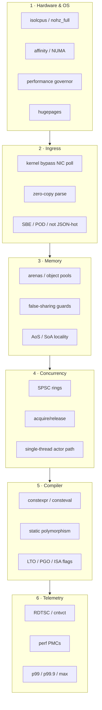

# Ultimate Low-Latency C++ Stack — Blueprint

Low-latency C++ is not a single trick (a lock-free queue). It is a **vertical stack**:
hardware and OS → packet path → memory → concurrency → compiler → measurement.

## Macro-architecture warning (i-cache)

Most public “low-latency” repos show a lock-free queue and stop. They miss:

1. **Instruction-cache pressure** — bloated critical paths miss L1 i-cache more often than they miss L1 d-cache.  
2. **Queue depth** — a perfect SPSC still delivers multi-millisecond latency if producers outrun consumers.  
3. **Measurement lies** — means hide the outliers that lose money or SLO budgets.

This repository therefore pairs **small, header-only `ll::*` modules** with an **ecosystem of libraries** and insists that **tail latency** and **code footprint** are first-class.

## What “definitive” means here

| Deliverable | Location |
|-------------|----------|
| Checklist audit | [AUDIT.md](AUDIT.md) |
| Layer deep-dives | `01` … `06` |
| Modules | `include/ll/*.hpp` |
| Examples | `examples/*` |
| Tests | `tests/test_ll_modules.cpp` + library suites |
| Third-party mesh | `docs/libraries/*` |

## Critical path design recipe

1. **Pin** the thread (Linux) / elevate QoS (macOS).  
2. **Pre-touch** memory; prefer arenas/pools.  
3. **Ingress** into a POD layout (or SBE); never JSON on the absolute critical path if you can avoid it.  
4. **Handoff** via SPSC (or no handoff — single actor thread).  
5. **Process** with branch-predictable, non-virtual code.  
6. **Sample** latency into a fixed buffer; analyze p99+ offline.  
7. **Keep the binary small** on that path — split cold diagnostics.

## Relationship to the assembler conflator

The public [hft-asm-l2-conflator](https://github.com/Dmdv/hft-asm-l2-conflator) demonstrates an **end-to-end** exclusive-shard “actor” path with AArch64 kernels.  
This repo supplies the **portable C++26 primitives + ecosystem** that surround such a path.

Together they answer:

- *How do I structure libraries?* → systems stack  
- *How do I structure an HFT-style pipeline?* → conflator  
- *What must the OS/NIC give me?* → blueprint §1–§2  

---

## Next modules (roadmap)

| Priority | Module | Layer |
|----------|--------|-------|
| P1 | HDR histogram (no alloc) | §6 |
| P1 | MPSC fan-in (ticket or hierarchical SPSC) | §4 |
| P2 | SBE schema example | §2 |
| P2 | `mmap` hugepage arena backend (Linux) | §1/§3 |
| P3 | DPDK/Onload **interface sketch** only | §2 |
