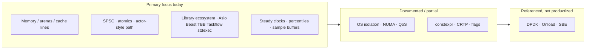

# Low-Latency C++ Stack Blueprint

This document family is an **architecture audit and expansion plan** for a
cutting-edge low-latency C++26 systems repository. It maps industry expectations
onto **what this project ships today**, what is **documented**, and what remains
**intentionally out of scope** (or next-module work).

## Layer index

| # | Layer | Guide | Code modules | Tests / examples |
|---|--------|-------|--------------|------------------|
| 1 | Hardware & OS tuning | [01-hardware-os.md](01-hardware-os.md) | `ll/affinity.hpp` | `[ll][affinity]` |
| 2 | Network ingress & encoding | [02-network-ingress.md](02-network-ingress.md) | Asio/Beast/simdjson/gRPC | existing suites |
| 3 | Memory & cache locality | [03-memory.md](03-memory.md) | `ll/arena.hpp`, `ll/cache_line.hpp` | `[ll][arena]`, examples/arena |
| 4 | Concurrency & lock-free | [04-concurrency.md](04-concurrency.md) | `ll/spsc_queue.hpp` | `[ll][spsc]`, examples/spsc, memory_order |
| 5 | Compiler & language | [05-compiler.md](05-compiler.md) | `ll/branch.hpp` | `[ll][branch]` |
| 6 | Benchmarking & telemetry | [06-telemetry.md](06-telemetry.md) | `ll/tsc_clock.hpp` | `[ll][tsc]`, examples/tsc |

Master audit: **[AUDIT.md](AUDIT.md)** · Narrative: **[LOW_LATENCY_STACK.md](LOW_LATENCY_STACK.md)**

## Where this repository focuses hardest

**Short answer to “which layer is the center of gravity?”**  
**Concurrency + memory architecture + the C++26 library mesh (I/O, parse, schedule)** — with explicit documentation of hardware/OS and kernel-bypass as the surrounding envelope.

---

## Related public work

| Repository | Relationship |
|------------|----------------|
| **This repo** (`cpp26-systems-stack`) | Ecosystem + portable `ll::*` primitives + guides |
| [hft-asm-l2-conflator](https://github.com/Dmdv/hft-asm-l2-conflator) | End-to-end HFT-style conflator (AArch64 kernels, exclusive-shard path) |
