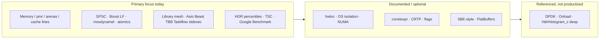

# Low-Latency C++ Stack Blueprint

This document family is an **architecture audit and expansion plan** for a
cutting-edge low-latency C++26 systems repository. It maps industry expectations
onto **what this project ships today**, what is **documented**, and what remains
**intentionally out of scope** (or next-module work).

## Layer index

| # | Layer | Guide | Code modules | Tests / examples |
|---|--------|-------|--------------|------------------|
| 1 | Hardware & OS tuning | [01-hardware-os.md](01-hardware-os.md) | `ll/affinity.hpp`, **hwloc** | `[ll][affinity]`, `[industry][hwloc]` |
| 2 | Network ingress & encoding | [02-network-ingress.md](02-network-ingress.md) | Asio/Beast, `ll/sbe_style`, FlatBuffers | industry suite, `example_sbe_style` |
| 3 | Memory & cache locality | [03-memory.md](03-memory.md) | `ll/arena`, `ll/pmr_arena`, `ll/cache_line`, mimalloc | `[industry][pmr]`, `example_pmr` |
| 4 | Concurrency & lock-free | [04-concurrency.md](04-concurrency.md) | `ll/spsc_queue`, Boost.Lockfree, moodycamel | industry queues example + stress tests |
| 5 | Compiler & language | [05-compiler.md](05-compiler.md) | `ll/branch.hpp` | `[ll][branch]` |
| 6 | Benchmarking & telemetry | [06-telemetry.md](06-telemetry.md) | `ll/tsc_clock`, `ll/hdr_histogram`, Google Bench | `example_hdr`, `bench_queues` |
| — | Industry library map | [07-industry-libraries.md](07-industry-libraries.md) | CMake `STACK_WITH_*` | `test_industry_stack` |

Master audit: **[AUDIT.md](AUDIT.md)** · Narrative: **[LOW_LATENCY_STACK.md](LOW_LATENCY_STACK.md)** ·  
Hands-on tutorial: **[../tutorials/industry-stack.md](../tutorials/industry-stack.md)**

## Where this repository focuses hardest

**Short answer to “which layer is the center of gravity?”**  
**Concurrency + memory architecture + the C++26 library mesh**, now wired to
**industry standards** (Boost.Lockfree, moodycamel, std::pmr, hwloc, FlatBuffers,
Google Benchmark, mimalloc) — with kernel bypass kept as a documented envelope.

**What we recommend building next:** production **SBE codegen** and Linux
**numa/uring** path hardening (see AUDIT “Next recommended investment”).

---

## Related public work

| Repository | Relationship |
|------------|----------------|
| **This repo** (`cpp26-systems-stack`) | Ecosystem + portable `ll::*` + industry optional libs |
| [hft-asm-l2-conflator](https://github.com/Dmdv/hft-asm-l2-conflator) | End-to-end HFT-style conflator (AArch64 kernels) |
