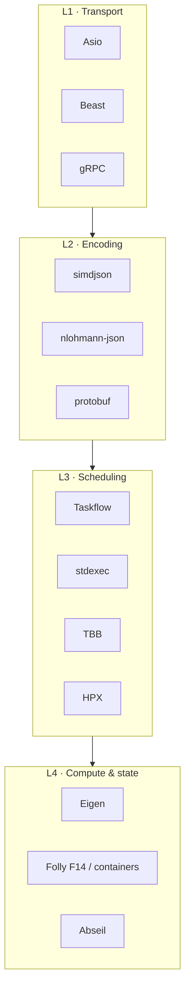

# C++26 Systems Stack — Library Catalog

Architecture-oriented notes for each component wired into this repository.  
Each guide covers **role in a systems stack**, **when to choose it**, **integration in this project**, and **how it is validated**.

## Catalog

| Guide | Package | Primary responsibility |
|-------|---------|------------------------|
| [Asio](./asio.md) | `asio` (standalone) / Boost.Asio | Async I/O, timers, executors |
| [Beast](./beast.md) | Boost.Beast | HTTP and WebSocket on Asio |
| [Taskflow](./taskflow.md) | Taskflow | Explicit task graphs and pipelines |
| [oneTBB](./tbb.md) | oneTBB | Data-parallel algorithms and concurrent structures |
| [stdexec](./stdexec.md) | NVIDIA stdexec | P2300 senders/receivers composition |
| [simdjson](./simdjson.md) | simdjson | High-throughput JSON parsing |
| [protobuf + gRPC](./grpc-protobuf.md) | protobuf, gRPC | Schemas and RPC services |
| [Folly](./folly.md) | Folly (optional) | Service utilities, F14, futures |
| [HPX](./hpx.md) | HPX (optional) | Distributed/local parallel runtime |

### Foundation packages (covered in `test_libs` / integration binary)

| Package | Role |
|---------|------|
| **fmt** | Type-safe formatting (C++20/23 `std::format` sibling ecosystem) |
| **spdlog** | Structured, fast logging on top of fmt |
| **Abseil** | `StrCat` / `StrFormat`, flat hash maps, status-style utilities |
| **range-v3** | Lazy views and algorithms (bridge until full std ranges coverage) |
| **Eigen** | Dense linear algebra |
| **nlohmann-json** | Ergonomic JSON for config and non-hot paths |
| **Catch2 / GTest** | Unit and integration testing |

## Selection matrix

| Requirement | Prefer | Avoid for that job |
|-------------|--------|--------------------|
| Timers, sockets, executors | **Asio** | Taskflow alone |
| HTTP / WebSocket framing | **Beast** | raw sockets without a protocol layer |
| Named multi-stage pipelines | **Taskflow** | ad-hoc thread pools without graph structure |
| Parallel for / reduce / sort | **TBB** (or HPX) | serial loops on large batches |
| Lazy composable async | **stdexec** | deeply nested callbacks without structure |
| Hot-path market JSON | **simdjson** | nlohmann-json on the critical path |
| Config / human-facing JSON | **nlohmann-json** | simdjson for one-off scripts (overkill) |
| Cross-process contracts | **protobuf + gRPC** | ad-hoc JSON RPC without schema |
| In-process service helpers | **Folly** (opt-in) | pulling Folly into every TU by default |
| HPC-style parallel runtime | **HPX** (opt-in) | using HPX as a network stack |

## Layered architecture



## Recommended study / adoption order

```text
1. Asio           — event loop, posts, timers, strands
2. Beast          — HTTP messages, WebSocket streams
3. Taskflow       — explicit DAGs for multi-stage processing
4. TBB            — parallel_reduce / concurrent containers
5. stdexec        — sender/receiver composition (standard direction)
6. simdjson       — parse high-volume JSON off the I/O thread
7. protobuf/gRPC  — versioned contracts and service boundaries
8. Folly          — opt-in utilities once the base stack is solid
9. HPX            — opt-in when you need that runtime model
```

## How this maps to tests

| Suite | Command | Components exercised |
|-------|---------|----------------------|
| Integration binary | `./build/lib_smoke` | Full base stack (+ Folly/HPX if enabled) |
| Asio + Beast | `ctest -R beast` | `test_beast_asio` |
| Taskflow | `ctest -R taskflow` | `test_taskflow` |
| Multi-lib Catch2 | `ctest -R libs` / `test_libs` | fmt, TBB, simdjson, json, Eigen, Abseil, ranges, protobuf, stdexec |
| GTest install | `ctest -R gtest` | `test_gtest_smoke` |
| Folly profile | `make folly` | `test_folly` |
| HPX profile | `make hpx` | `test_hpx` |

## Build profiles

| Profile | CMake flags | Use case |
|---------|-------------|----------|
| **Base** | defaults | Daily development, CI of core stack |
| **Folly** | `-DLIB_SMOKE_WITH_FOLLY=ON` | Service-utility integration |
| **HPX** | `-DLIB_SMOKE_WITH_HPX=ON` | Parallel runtime experiments |
| **Full** | Folly + HPX | Complete optional surface |

See the repository [README](../../README.md) for install and Make targets.
